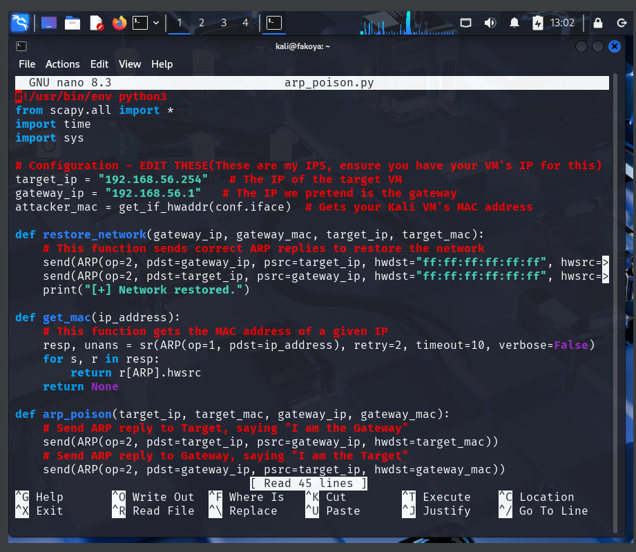
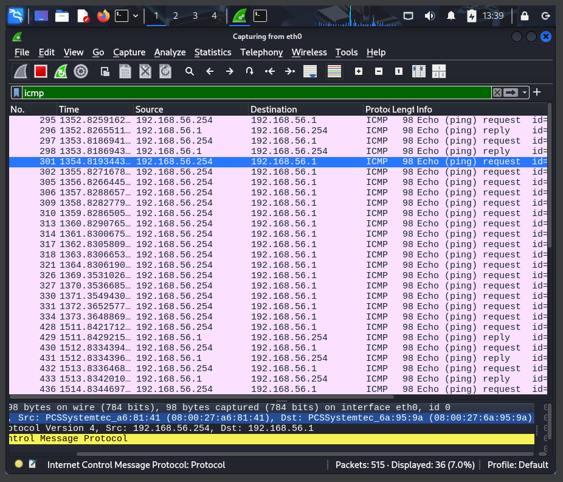

# Project: MITM Attack Detection & Prevention with ARP Poisoning and DNS Spoofing

## Overview
This project demonstrates Man-in-the-Middle (MITM) attack techniques using ARP poisoning and DNS spoofing, along with detection methods and prevention strategies. The implementation includes Python scripts for attack simulation, Wireshark analysis for detection, and comprehensive security measures.

---

## Organizational Application

### Importance to Companies
MITM attack detection is crucial for organizations to protect sensitive data, maintain network integrity, and prevent unauthorized access. Understanding these attack vectors helps companies implement effective security controls and monitoring systems.

### Use Case Scenario
A financial institution needs to protect customer data and transaction information from interception. The MITM detection implementation provides:
- Real-time monitoring of ARP traffic anomalies
- Detection of unauthorized DNS modifications
- Prevention of credential theft and data interception
- Compliance with data protection regulations
- Employee security awareness training

### Security Benefits
- **Data Protection**: Prevents interception of sensitive information
- **Network Integrity**: Maintains trust in network communications
- **Threat Detection**: Early identification of malicious activities
- **Compliance**: Meets regulatory requirements for data security

---

## Configuration & Screenshots

### 1. NetfilterQueue Installation
- Installed python3-netfilterqueue package
- Configured dependencies for packet manipulation
- Verified successful installation


*Package installation for network packet processing*

### 2. ARP Poisoning Script Development
- Created arp_poison.py script for MITM attacks
- Implemented MAC address spoofing functionality
- Configured target and gateway IP addresses


*ARP poisoning script development in nano editor*

### 3. Network Reconnaissance
- Conducted ARP table examination on target machine
- Identified legitimate MAC address mappings
- Established baseline network topology


*ARP table examination showing legitimate network mappings*

### 4. ARP Poisoning Execution
- Launched ARP poisoning attack
- Generated spoofed ARP responses
- Monitored attack progress and packet transmission


*ARP poisoning attack execution and packet transmission*

### 5. ARP Table Manipulation
- Verified successful ARP cache poisoning
- Observed malicious MAC address entries
- Confirmed MITM position establishment


*Successful ARP cache poisoning showing malicious entries*

### 6. Network Traffic Analysis
- Captured and analyzed spoofed ARP packets
- Identified malicious Who-has and Is-at responses
- Monitored network traffic patterns


*Wireshark analysis showing malicious ARP packets*

### 7. Connectivity Verification
- Maintained network connectivity during attack
- Verified successful packet interception
- Monitored ICMP traffic flow


*Ping connectivity verification during MITM attack*

### 8. Packet Capture Analysis
- Examined intercepted ICMP packets
- Identified attacker MAC address in traffic
- Analyzed packet routing through attacker


*Wireshark analysis showing intercepted ICMP packets*

### 9. DNS Spoofing Script Development
- Created dns_poison.py script for DNS manipulation
- Implemented domain spoofing functionality
- Configured NetfilterQueue integration


*DNS spoofing script development in nano editor*

### 10. DNS Spoofing Configuration
- Implemented DNS response crafting
- Configured domain redirection rules
- Set up iptables rules for packet interception


*DNS spoofing configuration and iptables setup*

---

## Prevention Methods

- **Port Security**: Enable MAC address filtering on network switches
- **Network Segmentation**: Implement VLANs to isolate sensitive traffic
- **Dynamic ARP Inspection**: Use switch security features to validate ARP packets
- **DNSSEC Implementation**: Deploy DNS Security Extensions for response validation
- **Encrypted DNS**: Use DNS-over-HTTPS (DoH) or DNS-over-TLS (DoT)
- **Certificate Monitoring**: Implement SSL/TLS certificate validation

## Detection Methods

- **ARP Monitoring Tools**: Deploy ARPWatch or similar detection software
- **Network Traffic Analysis**: Monitor for unusual ARP traffic patterns and Check system logs for ARP table changes
- **IDS/IPS Systems**: Implement intrusion detection for ARP anomalies
- **DNS Query Monitoring**: Watch for abnormal DNS request patterns and check system logs for DNS spoofing attempts

## Mitigation Strategies

- **Isolate Compromised Systems**: Quickly remove affected devices from network
- **Clear Poisoned Caches**: Flush ARP and DNS caches on impacted systems
- **Block Malicious Actors**: Update firewall rules to block attack sources
- **Network Access Control**: Implement 802.1X authentication
- **Regular Audits**: Conduct periodic security assessments

## Essential Tools
- **ARP Protection**: ARPWatch, XArp, switch security features
- **DNS Security**: DNSSEC validators, DNS filtering services
- **Network Monitoring**: IDS/IPS systems, SIEM solutions
- **Endpoint Protection**: Host-based firewalls, EDR solutions

---

## How to Reproduce

### Prerequisites
- Kali Linux attacker machine
- Target machine (Metasploitable used in testing)
- Network connectivity between systems
- Python 3.x and required libraries
- Administrative privileges

### Installation Steps

1. **System Preparation**
```bash
sudo apt update && sudo apt upgrade -y
```

2. **Required Packages**
```bash
sudo apt install python3-netfilterqueue -y
pip install scapy
```

3. **ARP Poisoning Attack – Script Creation**
```bash
nano arp_poison.py
```

4. **Run ARP Poisoning Script**
```bash
sudo python3 arp_poison.py
```

5. **DNS Spoofing Attack – Script Creation**
```bash
nano dns_poison.py
```

6. **Run DNS Spoofing Script**
```bash
sudo python3 dns_poison.py
```

7. **Detection and Analysis – Wireshark Monitoring**
```bash
sudo wireshark
```

8. **Verify ARP Table**
```bash
arp -a
```

9. **Test Network Connectivity**
```bash
ping 192.168.56.1
```
